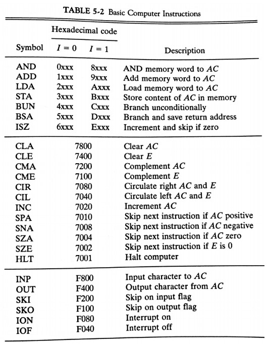
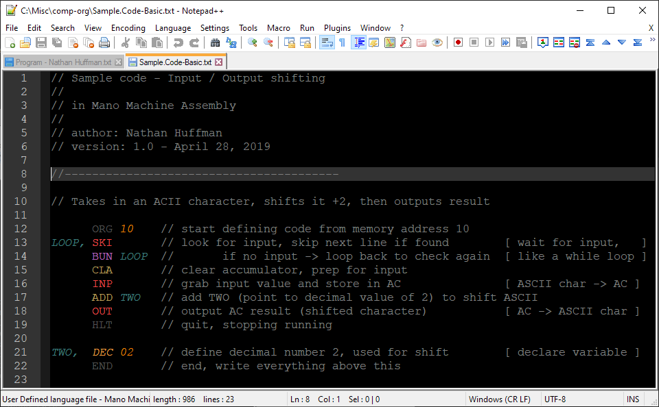

# Mano Machine Assembly

Welcome to this collection of resources for programming in the Mano machine assembly language!\
I hope you find them useful!

---

## Mano Commands:

---

## Useful sites:

The following sites, particularly sandsduchon.org, were critical to my understanding of Mano programming, and I hope they will be useful to you as well.

Perhaps the single best resource I've found, with sample code and solid explanations:
* http://sandsduchon.org/duchon/cs311/ManoTutorial/ManoIntroduction.html
* http://sandsduchon.org/duchon/cs311/ManoTutorial/ManoExamples.html

Provides more explanation of the Mano machine itself, including sample code:
* http://web.cecs.pdx.edu/~mperkows/CLASS_573/573_2007/luento8.pdf

---

## Tips:

### Comments!

Assembly code is frustratingly difficult to read at a glance, so commenting both what you are doing and why is essential to a successful programming experience.

### Incremental development!

Write and test your code in very small pieces first, as debugging large assembly programs requires tedious bit level examination of the memory. Developing fundamental things like for loops, if statements,and multiplication before you trying to put them together will save you massive headaches.

---

## Custom syntax highlighting:

Using Notepad++, a simple yet powerful text editor for Windows, it is possible to create custom syntax highlighting rules. Included here is a scheme I designed to help make Mano programs easier to follow by grouping commands by similar functions, identifying labels, and supporting hexadecimal numbers.

If you are using Mac and don't have Wine or a Windows VM, there might be comparable tools to build your own custom highlighting, but as of writing this there is not an existing solution.

---

### 1. Install Notepad++

To install, click the link below to download directly (which pulls from GitHub) and then run the executable.\
[Notepad++ installer link](https://github.com/notepad-plus-plus/notepad-plus-plus/releases/download/v7.8.5/npp.7.8.5.Installer.x64.exe)

### 2. Switch to dark theme

The Mano syntax highlighting is designed to work best with the dark theme. To switch to it, look to the top menu bar and go to "Settings" -> "Style Configurator". Then, in the top option box, set "Select theme:" to "Deep Black".

### 3. Import language file

Click the link below to directly download the syntax file, or get it from the repo (click "Mano.Syntax.xml", then "Raw", then right-click and "Save as...")\
[Mano Syntax](https://github.com/Nathan-Huffman/misc/releases/download/v0.1/Mano.Syntax.xml)

From within Notepad++, go to "Language"->"User Defined Language"->"Open User Defined Language folder". Move the "Mano.Syntax.xml" file you just downloaded to this folder, then after closing and reopening Notepad++, "Macho Machine" should be listed at the bottom of the "Language" tab.

### 4. Open sample code

If you don't have the sample code downloaded yet, you can get it directly from the link below.\
Then, open it in Notepad++ (right click, then "Open with...")\
[Sample Code - Basic](https://github.com/Nathan-Huffman/misc/releases/download/v0.1/Sample.Code-Basic.txt)

### 5. Select Mano Syntax

For each Mano programming file, you have to tell Notepad++ to use the custom syntax by clicking "Language"->"Mano Machine" with the specified file open. The colors and formatting should load immediately!

---

### Result:

Once these steps are completed, you should have a result that looks something like this!

### Modifications:

If you want to tweak the syntax colors or modify attributes such as code folding, go to "Language"->"User Defined Language"->"Define your language". Then in the top option box, select "Mano Machine". From here you can use the tabs to modify different attributes, looking for "Styler" buttons if you want to change the appearance of defined items.